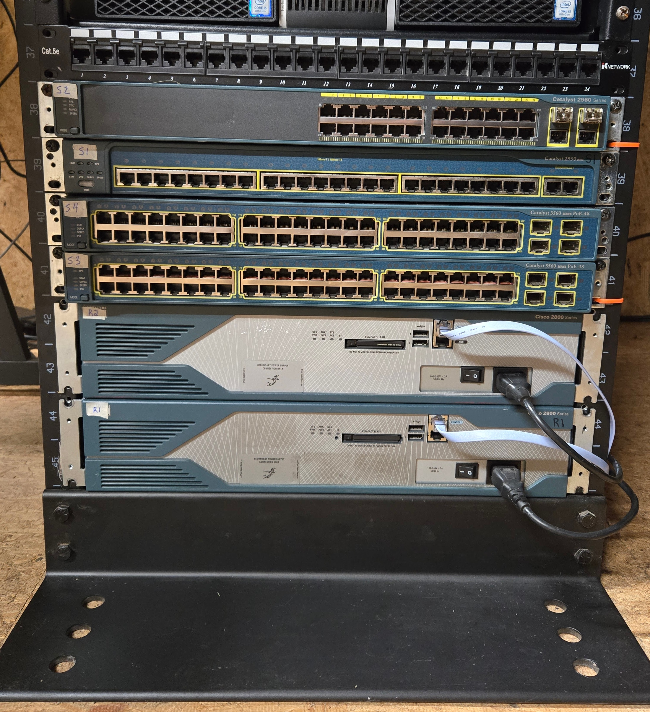
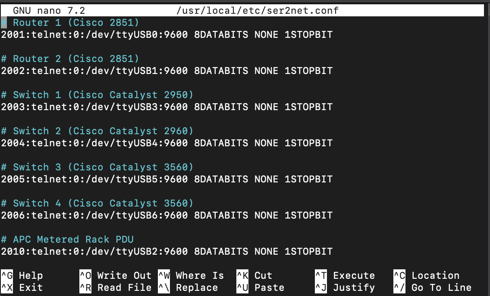
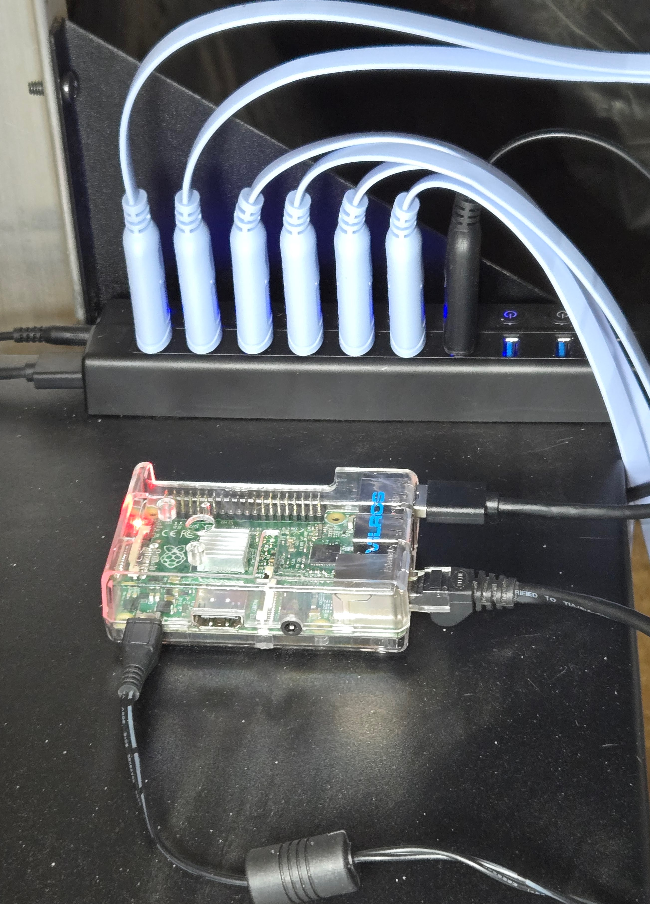

# Cisco Console Server for CCNA Home Lab

---

## 📘 Project Overview

To support my CCNA studies and deepen my understanding of network device management, I built a custom console server using a Raspberry Pi, powered USB hub, APC PDU, and an Alexa smart plug. My Cisco lab and work office are located in a building behind my house, while most of my studying takes place indoors. This setup allows **remote serial access** to multiple Cisco routers, switches, and the APC PDU — offering real-world hands-on experience.

> While console access is usually secondary to SSH, this project gave me valuable exposure to the underlying equipment and was a genuinely fun challenge to set up.

---

## 🛠️ Tools & Technologies

- Raspberry Pi 2B running Raspberry Pi OS  
- `ser2net` for serial-to-network communication  
- Cisco 2851 (x2), 2950, 2960, and 3560 (x2) switches  
- APC PDU for remote power control  
- Powered USB hub with multiple Cisco console cables  
- pfSense router for VLAN segmentation and DHCP reservations  

---

## ✨ Key Features

- Remote SSH/Telnet access to all devices from desktop or laptop  
- Reliable access via **DHCP reservation**  
- Clean device labeling in `ser2net.conf`  
- Power control managed through a smart plug and APC PDU  
- Efficient, centralized management from a Raspberry Pi interface  

---

## 🔧 Skills Demonstrated

- Cisco CLI configuration & troubleshooting  
- Linux service management and config editing  
- Serial communication using USB/RS232  
- Network design: VLANs, IP addressing, DHCP reservations  
- Home lab infrastructure planning & remote access  

---

## 📈 Next Steps

- Add **two WIC-2T serial interface cards** to increase router connectivity  
- Create a **smart serial crossover cable** to simulate WAN links  
- Continue building **CCNA labs** and explore **CCNP-level topologies**  
- Potential future automation (power cycle, device discovery, logging)

---

## 📎 Related Media

---

## 🔗 Portfolio & LinkedIn

📁 [View this project on my portfolio](https://your-portfolio-link.com)  
💼 [Connect with me on LinkedIn](https://linkedin.com/in/your-profile)
